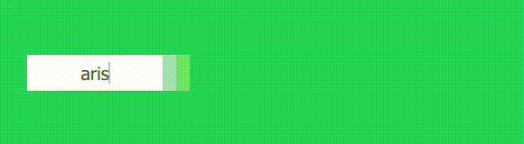
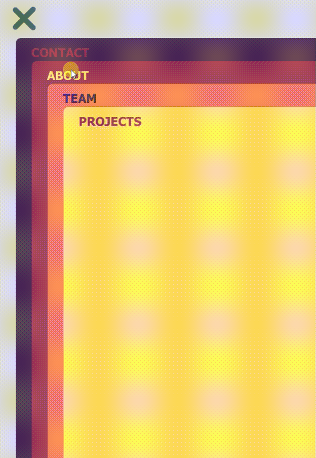
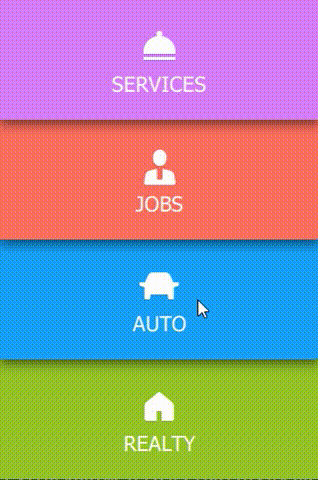
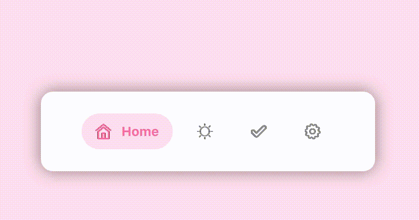

# QML-UI-Animations
QML implementations of various UI concepts by various artists

## Example Login by [enszgr](http://ens.ninja/)

An implementation of the login concept created by enszgr: http://ens.ninja/login-concept.html

Related blog post: http://zmc.space/2016/qml-login-animation/

## Cards Menu by [galshir](https://dribbble.com/galshir)

Implementation of the menu concept created by Gal Shir: https://dribbble.com/shots/2389505-Cards-Menu-Concept

## Swipe Up Reveal by [leoleung](https://dribbble.com/leoleung)

Swipe up to reveal concept created by Leo Leung: https://dribbble.com/shots/2493845-ToFind-Transition-Test

## Menu by [Volorf](https://dribbble.com/Volorf)

Menu concept created by Oleg Frolov: https://dribbble.com/shots/2653519-Menu

Assets in `Menu-by-Volorf/images` folder was taken from [here](http://share.framerjs.com/lg0nu9ecekfy/).

## QML-ExpandableBottomBar

A QML Clone of [ExpandableBottomBar](https://github.com/st235/ExpandableBottomBar)

### Credits

- Test icons from https://www.flaticon.com/packs/minimal-interface
